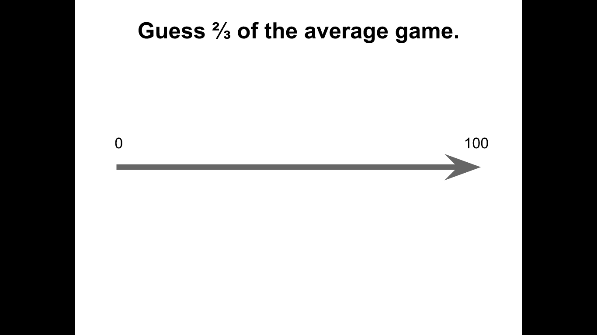
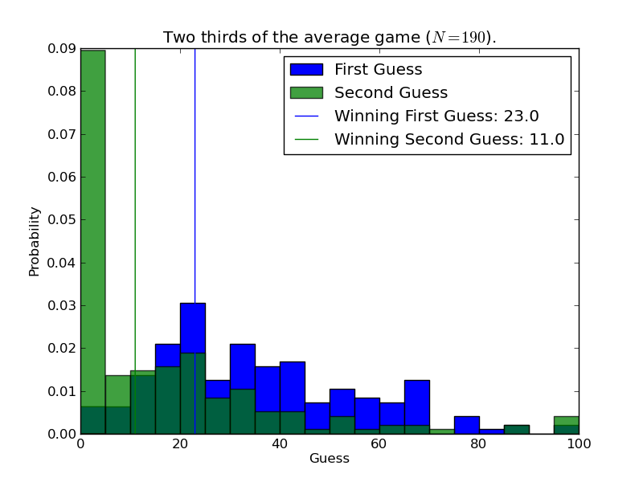

# Two thirds of the average game

The two thirds of the average game is a great way of introducing game theory to students. I use this game with [school kids](http://goo.gl/5u6Ic), [academics](http://goo.gl/JGWM7) and [everything in between](http://goo.gl/oHoz0).

Here's the definition of the game from the [wiki page](http://en.wikipedia.org/wiki/Guess_2/3_of_the_average):

> "In game theory, Guess 2/3 of the average is a game where several people guess what 2/3 of the average of their guesses will be, and where the numbers are restricted to the real numbers between 0 and 100, inclusive. The winner is the one closest to the 2/3 average."

I run this game during outreach events but have also recently put up an online version of the game: [http://twothirdsoftheaveragegame.appspot.com/](http://twothirdsoftheaveragegame.appspot.com/).

This was done using [google app engine](https://developers.google.com/appengine/). All the code for that website and code used to analysis the results can be found in the `webapp` and `Data_from_webapp` directories.

# As an outreach event

I run this game once without any instruction. I just explain the rules and let them fill in the form in front of them (contained in this repo).

I then bring up slides discussing how iterated elimination of weakly dominated strategies leaves the "rational" strategy to be that everyone guesses 0.

After this I invite the participants to give a second guess. In general the results are pretty cool as you see the initial shift towards equilibrium. The fact that the winning guess in the second play of the game is in fact not 0 gives an opportunity to discuss irrational behaviour and also what would happen if we played again (and again...).

This repo contains python code that analyses a csv file of the form:

    Name,Guess_1,Guess_2
    Alice,66,4
    Bob,32,100
    Celine,44,2

The program (`Data_analysis.py`) can be run on a directory (in which case it will analyse all csv files in that directory) or on a given csv file:

    ./Data_analysis.py All_Data.csv

Gives the following output:

    All_Data.csv.
    Data file read with 141 players
    Mean of the first guess: 33.7304964539 so 2/3rds of mean is: 22.4869976359
    Mean of the second guess: 15.2836879433 so 2/3rds of mean is: 10.1891252955
    Winning first guess: 22.0
    Winning second guess: 10.0

and produces the plot shown above.

An anonymous version of the All_Data.csv file (which is a collection of all the times I've recorded the results of this game) is also in this repo (if anyone would like to add to it: please do send me pull request :) ).

This has all been done to a much wider scale:
- [coursera](https://www.coursera.org/course/gametheory) have been able to collect a lot of data playing this with their game theory course
- here's a great [TED talk](http://youtu.be/uKByBgqxOw4) that mentions this game as well.

# License Information

This work is licensed under a [Creative Commons Attribution-ShareAlike 3.0](http://creativecommons.org/licenses/by-sa/3.0/us/) license.  You are free to:

* Share: copy, distribute, and transmit the work,
* Remix: adapt the work

Under the following conditions:

* Attribution: You must attribute the work in the manner specified by the author or licensor (but not in any way that suggests that they endorse you or your use of the work).
* Share Alike: If you alter, transform, or build upon this work, you may distribute the resulting work only under the same or similar license to this one.

When attributing this work, please include me.
